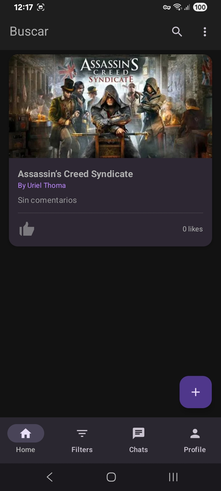
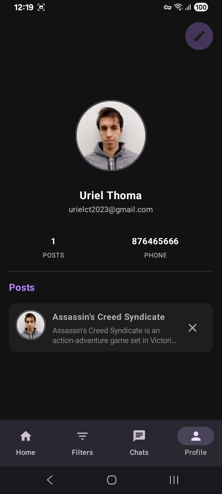
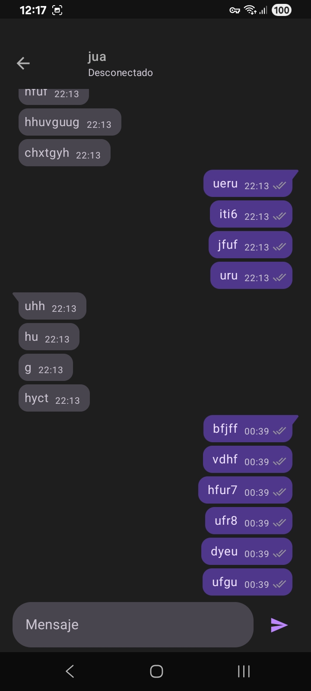
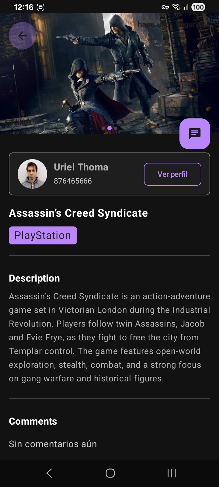
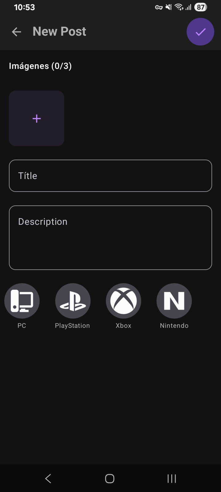

# SMGamer

> Aplicación de red social para Android que permite a los usuarios crear perfiles, compartir publicaciones, interactuar mediante likes y comentarios, y comunicación en tiempo real.

---

## 🖼️ Capturas de Pantalla

### 🏠 Home

<p align="center">
  
</p>

### 👤 Perfil

<p align="center">
  
</p>

### 💬 Chat / Mensajes

<p align="center">
  
</p>

### 📝 Publicación

<p align="center">
  
</p>

### ➕ Crear Publicación

<p align="center">
  
</p>

---

## 🚀 Funcionalidades

* Registro e inicio de sesión de usuarios
* Creación de perfil
* Acceso a camara y galeria
* Publicaciones con texto e imágenes
* Likes y comentarios
* Chat o mensajería privada

---

## 🛠️ Tecnologías Usadas

* 📱 Android (Kotlin)
* ⚛️ Framework: (Jetpack Compose)
* 🌐 Firebase 
* 🗄️ Base de datos:  Firestore, Cloudinary, DataStore
* 🔐 Autenticación: Firebase Auth
* Inyección de dependencias: Dagger Hilt

---

## 📂 Estructura del Proyecto

```
com.smgamer/
│── data/
│── di/
│── domain/
│── ui/
│── utils/
```

---

## ⚙️ Instalación y Ejecución

```bash
# Clonar el repositorio
git clone https://github.com/UrielCT/SMGamer.git

# Entrar al proyecto
cd nombre-del-repo

# Ejecutar la app
npm install
npm run dev
```

*(Ajustar según la tecnología usada)*

---

## 🔐 Variables de Entorno

Crear un archivo `.env` con las siguientes variables:

```env
API_URL=
DATABASE_URL=
JWT_SECRET=
```

---

## 🧪 Testing

```bash
npm run test
```

---


## 👨‍💻 Autor

**Uriel Thoma**
📍 Argentina
💼 Android / Estudiante / Desarrollador

---

## 📄 Licencia

Este proyecto está bajo la licencia MIT.

---

> ⭐ Si te gusta el proyecto, no olvides darle una estrella al repositorio
